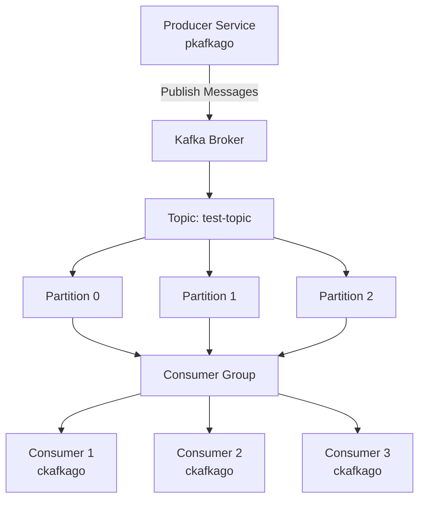
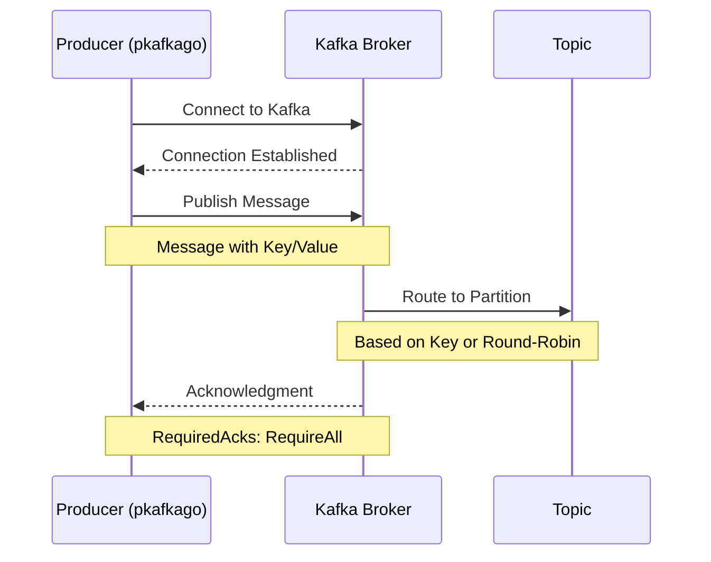
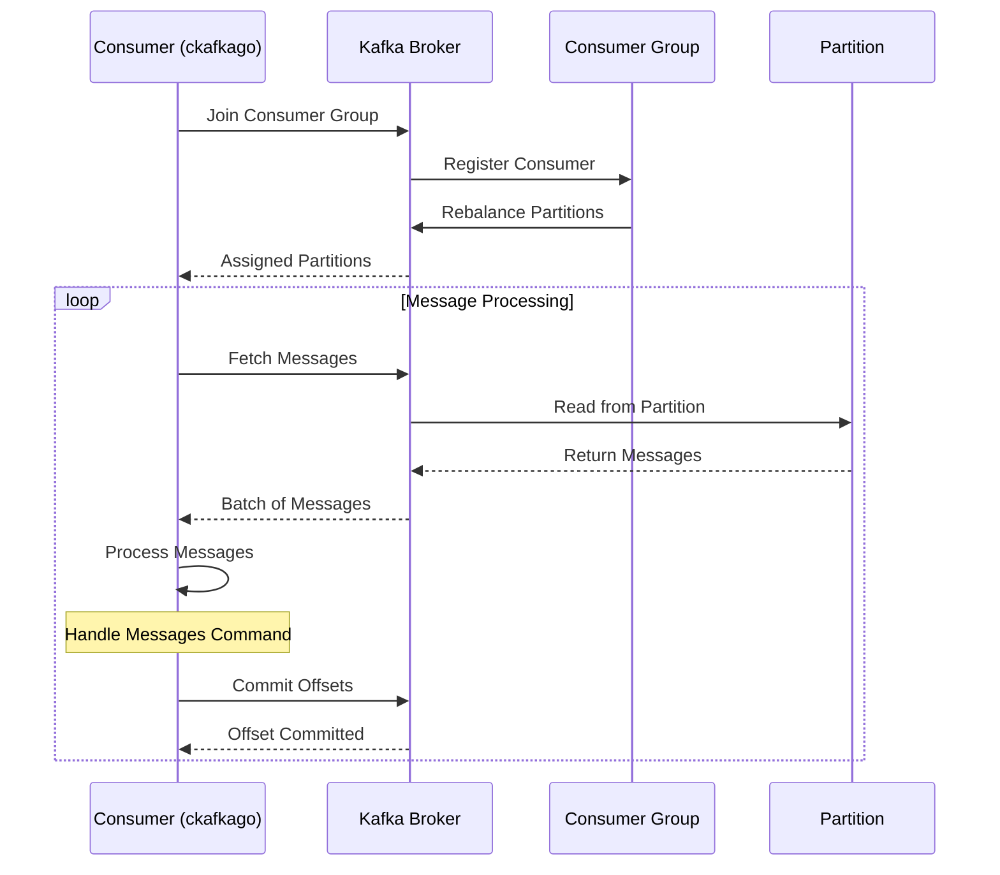
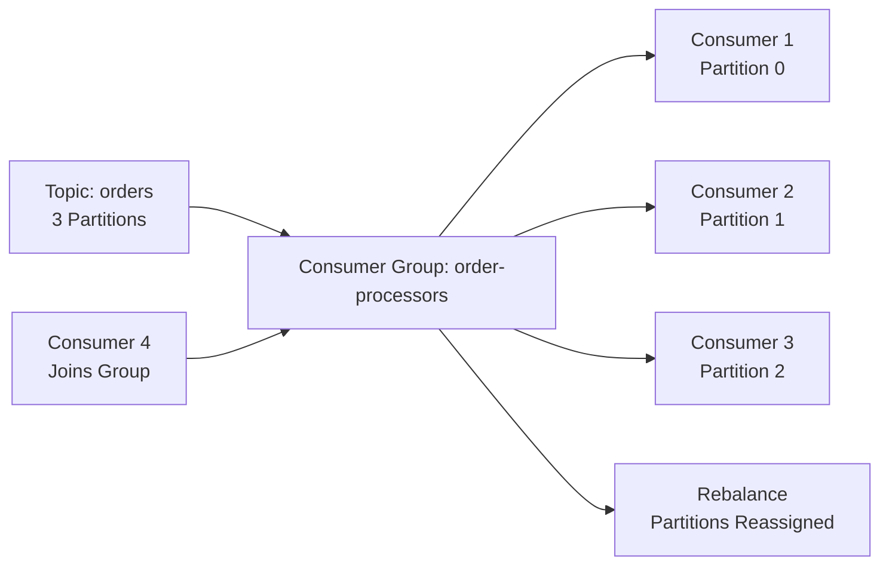
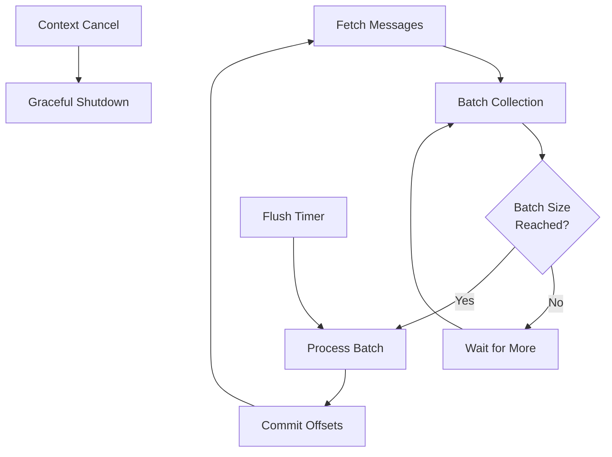
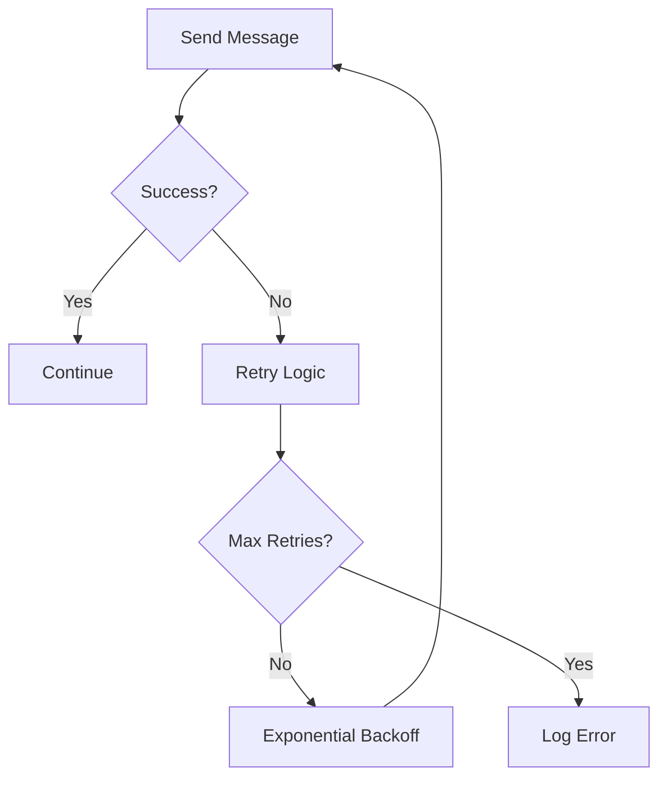
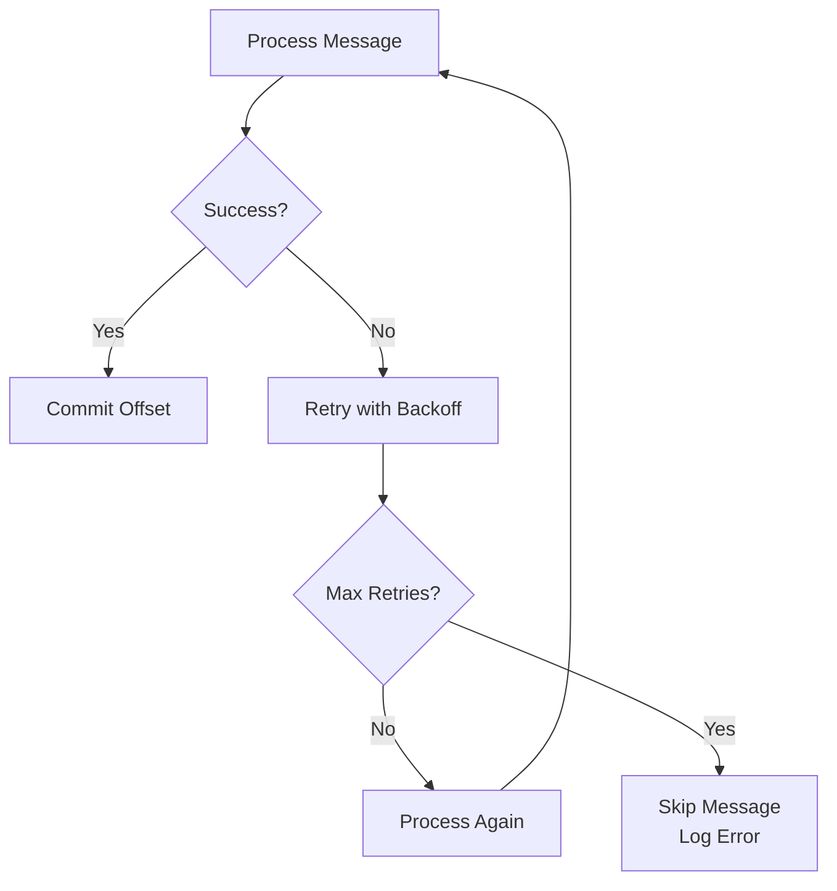

# Kafka Data Flow Documentation

## Overview

This document explains how data flows through the Kafka platform implementation, covering producer-to-consumer message flow, partitioning strategies, and consumer group coordination.

## Architecture Overview



## Message Flow Patterns

### 1. Producer Message Flow



**Producer Flow Details:**
1. **Connection**: Producer connects to Kafka broker cluster
2. **Message Creation**: Messages created with optional key and value
3. **Partitioning**: Messages routed to partitions based on:
   - Key-based partitioning (if key provided)
   - Round-robin distribution (if no key)
4. **Acknowledgment**: Producer waits for all replicas to acknowledge
5. **Async Processing**: Non-blocking message publishing

### 2. Consumer Message Flow



**Consumer Flow Details:**
1. **Group Coordination**: Consumer joins consumer group
2. **Partition Assignment**: Kafka assigns partitions to consumers
3. **Message Fetching**: Consumer fetches messages in batches
4. **Message Processing**: Messages processed by handler commands
5. **Offset Commit**: Manual offset commits ensure at-least-once delivery

## Partitioning Strategy

### Key-Based Partitioning

```go
// Messages with same key go to same partition
message := kafka.Message{
    Key:   []byte("user-123"),
    Value: []byte("user data"),
}
```

**Benefits:**
- Message ordering per key
- Predictable partition assignment
- Enables stateful processing

### Round-Robin Partitioning

```go
// Messages without key distributed evenly
message := kafka.Message{
    Key:   nil,  // No key
    Value: []byte("event data"),
}
```

**Benefits:**
- Even load distribution
- Maximum parallelism
- Simple implementation

## Consumer Group Coordination

### Load Balancing Across Consumers



**Rebalancing Scenarios:**

1. **Consumer Joins**: Partitions redistributed among all consumers
2. **Consumer Leaves**: Remaining consumers take over partitions
3. **Topic Changes**: New partitions assigned to consumers

### Partition Assignment Example

```
Initial State:
- Consumer 1: Partition 0
- Consumer 2: Partition 1
- Consumer 3: Partition 2

Consumer 2 Leaves:
- Consumer 1: Partition 0, 1
- Consumer 3: Partition 2

Consumer 4 Joins:
- Consumer 1: Partition 0
- Consumer 3: Partition 1
- Consumer 4: Partition 2
```

## Batch Processing Flow

### Consumer Batch Processing



**Batch Processing Configuration:**
```json
{
  "readBatchSize": 100,
  "flushInterval": 1000,
  "flushMaxRetries": 3
}
```

## Error Handling Flow

### Producer Error Handling



### Consumer Error Handling



## Message Transformation

### Raw Kafka Message to Platform Message

```go
func transformMessage(msg *kafka.Message) *message.Message {
    return &message.Message{
        Topic:     msg.Topic,
        Partition: msg.Partition,
        Offset:    msg.Offset,
        Key:       msg.Key,
        Value:     msg.Value,
        Time:      msg.Time,
    }
}
```

### Header Processing

```go
func transformMessageHeaders(headers []kafka.Header) message.Headers {
    result := make(message.Headers, len(headers))
    for _, header := range headers {
        result[header.Key] = header.Value
    }
    return result
}
```

## Monitoring and Observability

### Key Metrics Tracked

1. **Producer Metrics:**
   - Messages sent per second
   - Batch size distributions
   - Error rates and types

2. **Consumer Metrics:**
   - Messages processed per second
   - Consumer lag (offset difference)
   - Processing time per batch

3. **System Metrics:**
   - Partition distribution
   - Consumer group health
   - Broker connectivity

### Kafka UI Monitoring

Access Kafka UI at:
- **Producer**: http://localhost:8888
- **Consumer**: http://localhost:8881

**Features:**
- Topic and partition management
- Consumer group monitoring
- Message browsing and searching
- Real-time metrics dashboard