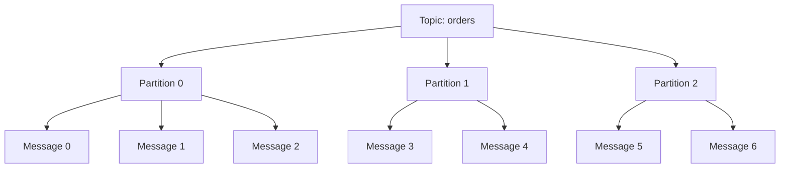
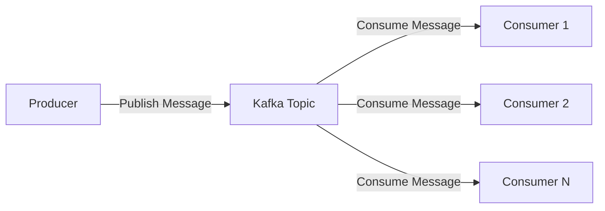
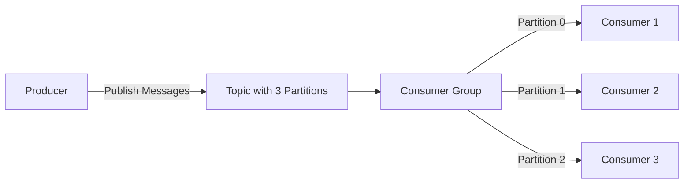

# Kafka Core Documentation

## Overview

Apache Kafka is a distributed event streaming platform designed to handle high-throughput, low-latency real-time data feeds. This document covers core Kafka functionality, architecture, and implementation patterns used in the platform.

## Kafka Architecture

### Core Components

1. **Brokers**: Kafka servers that store and serve data
2. **Topics**: Categories for organizing messages (like channels)
3. **Partitions**: Ordered sequences of messages within topics
4. **Producers**: Applications that publish messages to topics
5. **Consumers**: Applications that read messages from topics
6. **Consumer Groups**: Collections of consumers working together
7. **Zookeeper**: Coordination service for cluster management

### Topic Structure



**Key Characteristics:**
- Messages within a partition are ordered
- Messages across partitions have no ordering guarantee
- Partitions enable parallel processing and horizontal scaling

## Platform Implementation

### Producer (`pkafkago`)

The producer service handles message publishing with the following features:

```go
type Dialer struct {
    writer *kafka.Writer
    cfg    config.Kafka
}
```

**Producer Configuration:**
- **RequiredAcks**: `RequireAll` - ensures all replicas acknowledge
- **Async**: `true` - non-blocking message publishing
- **AllowAutoTopicCreation**: `true` - topics created automatically
- **WriteTimeout**: Configurable timeout for write operations

**Message Publishing Flow:**
1. Producer connects to Kafka broker
2. Messages are written to specified topics
3. Kafka handles partitioning and replication
4. Producer receives acknowledgment

### Consumer (`ckafkago`)

The consumer service processes messages with robust error handling:

```go
type Consumer struct {
    reader                *kafka.Reader
    logger                *slog.Logger
    handleMessagesCommand message.Command[message.HandleMessagesCommandOptions]
    config                *config.KafkaConsumer
    consumerID            string
}
```

**Consumer Features:**
- **Batch Processing**: Configurable batch sizes for efficiency
- **Retry Logic**: Exponential backoff for failed operations
- **Commit Management**: Manual offset commits for at-least-once delivery
- **Error Handling**: Comprehensive error recovery and logging

## Message Structure

```go
type Message struct {
    Headers       Headers
    Topic         string
    Partition     int
    Offset        int64
    HighWaterMark int64
    Key           []byte
    Value         []byte
    Time          time.Time
}
```

**Message Components:**
- **Key**: Used for partitioning (optional)
- **Value**: Actual message payload
- **Headers**: Key-value metadata
- **Offset**: Unique position in partition
- **Timestamp**: Message creation time

## Data Flow Patterns

### 1. **Producer-Consumer Pattern**



**Characteristics:**
- One-to-many messaging
- Multiple consumers can read same messages
- Messages persist until retention period expires

### 2. **Consumer Groups (Load Balancing)**



**Load Balancing Benefits:**
- Each partition consumed by only one consumer in group
- Automatic rebalancing when consumers join/leave
- Horizontal scaling through additional consumers

### 3. **Partitioning Strategy**

Messages are distributed across partitions based on:
- **Key-based partitioning**: Messages with same key go to same partition
- **Round-robin**: Even distribution when no key provided
- **Custom partitioner**: Application-defined partitioning logic

## Configuration

### Producer Configuration
```json
{
  "kafka": {
    "dsn": "localhost:9093",
    "topics": {
      "testTopic": "test-topic"
    },
    "writeTimeoutSec": 30
  }
}
```

### Consumer Configuration
```json
{
  "kafkaConsumer": {
    "readBatchSize": 100,
    "flushInterval": 1000,
    "flushMaxRetries": 3,
    "commitMaxRetries": 3,
    "fetchMaxRetries": 3
  }
}
```

## Monitoring & Operations

### Kafka UI
- **URL**: http://localhost:8888 (producer) / http://localhost:8881 (consumer)
- **Features**: Topic management, message browsing, consumer group monitoring

### Health Checks
Both services implement health check endpoints:
- **Producer**: HTTP endpoint for service health
- **Consumer**: Kafka connectivity health checks

### Logging
Comprehensive structured logging with:
- Message processing status
- Error details and stack traces
- Consumer group coordination events
- Performance metrics

## Error Handling & Reliability

### Producer Reliability
- **RequiredAcks**: All replicas must acknowledge
- **Retry Logic**: Built-in retry for transient failures
- **Connection Pooling**: Efficient resource management

### Consumer Reliability
- **At-Least-Once Delivery**: Manual offset commits
- **Batch Processing**: Configurable batch sizes
- **Exponential Backoff**: Smart retry strategies
- **Panic Recovery**: Graceful handling of unexpected errors

### Common Error Scenarios
1. **Network Partitions**: Automatic reconnection
2. **Broker Failures**: Consumer group rebalancing
3. **Processing Failures**: Retry with exponential backoff
4. **Offset Management**: Manual commits prevent message loss

