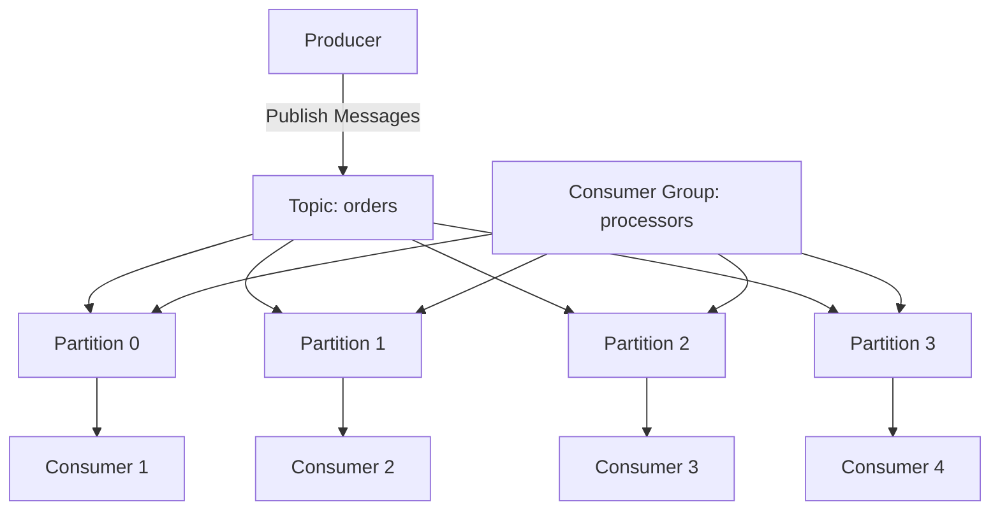
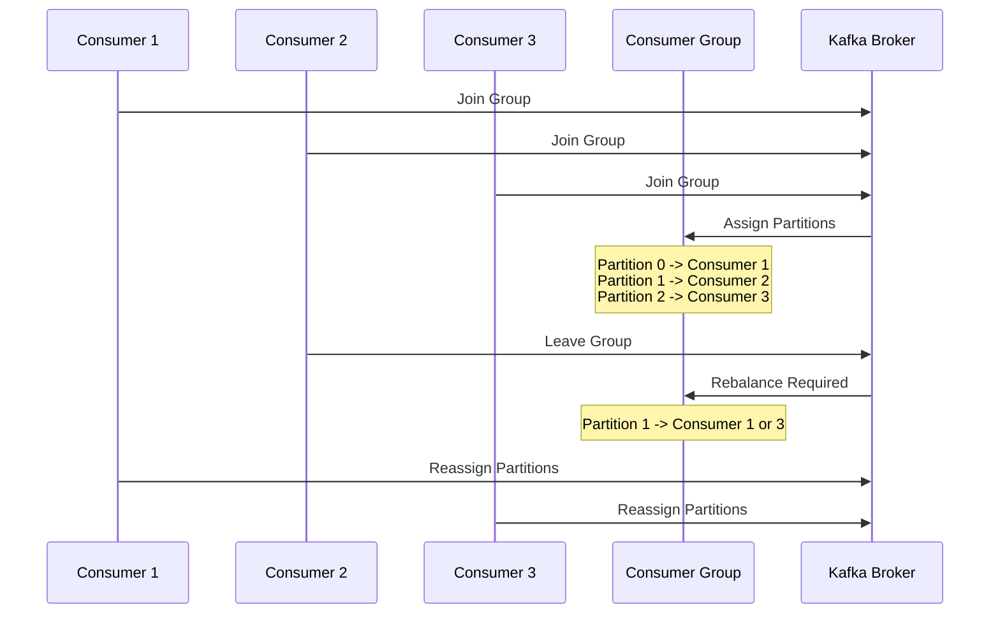
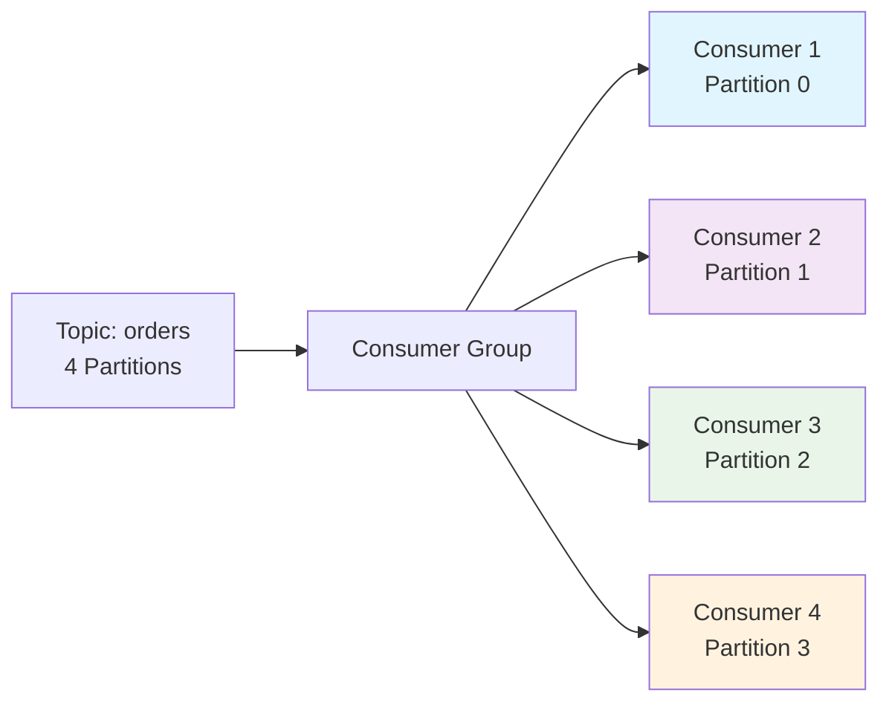
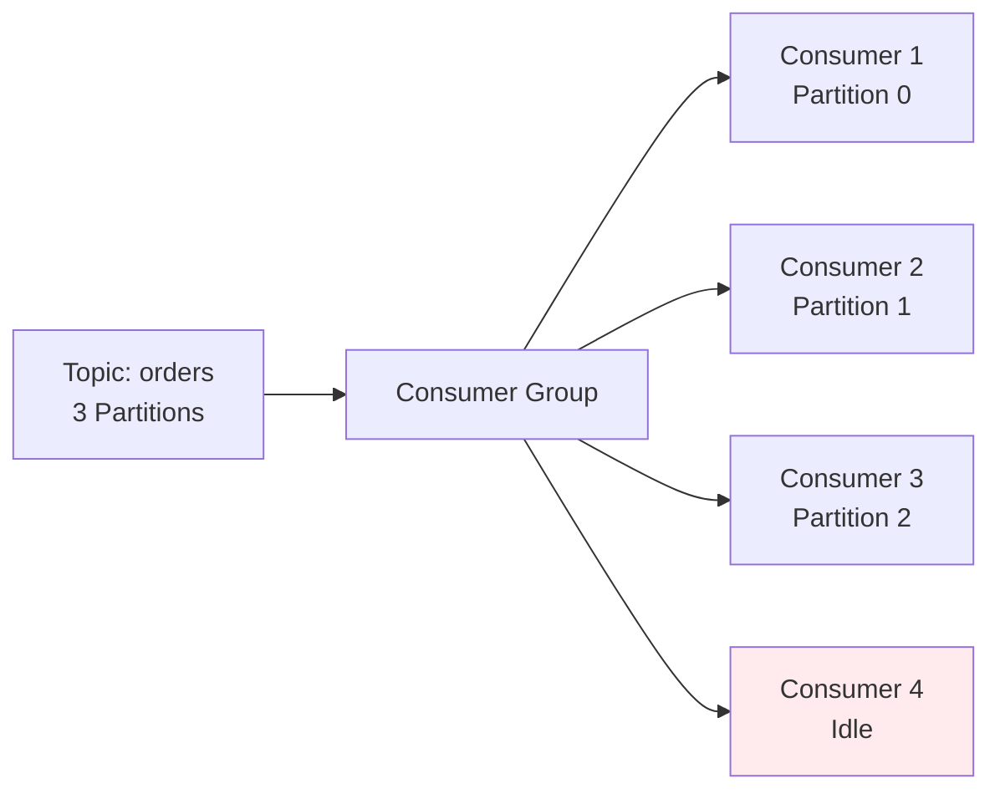
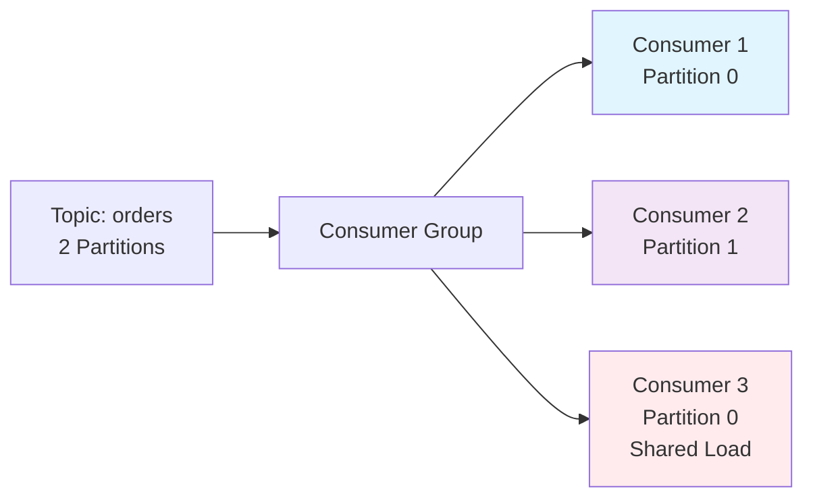
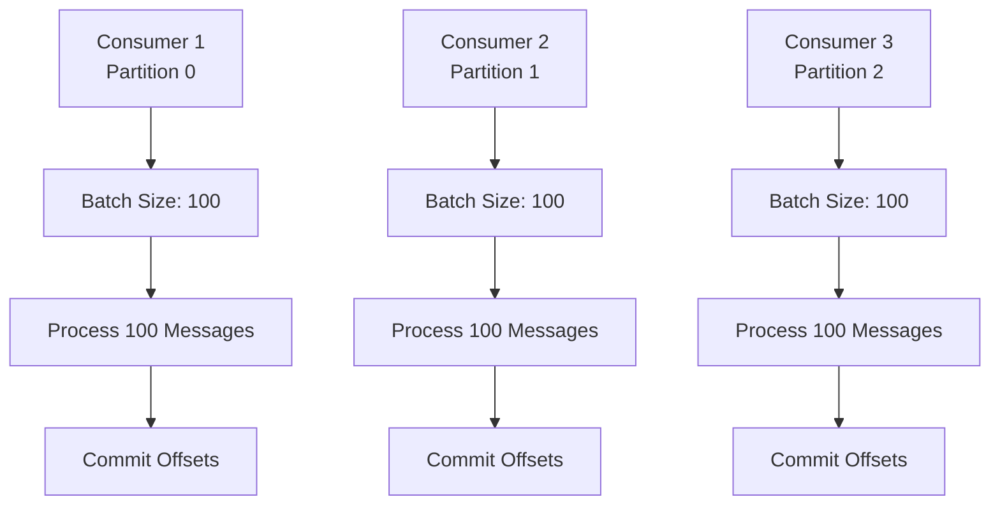
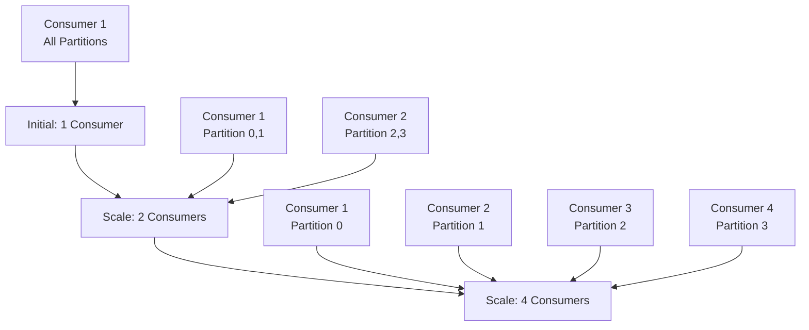
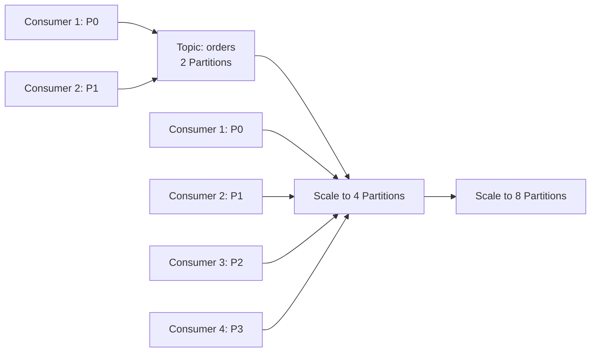
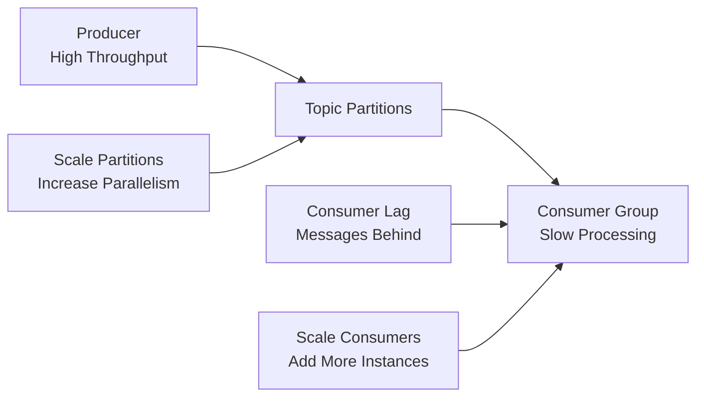

# Kafka Load Balancing Documentation

## Overview

Kafka provides sophisticated load balancing through partitioning and consumer groups. This document covers how Kafka distributes messages across multiple consumers for efficient processing and horizontal scaling.

## Partitioning and Load Balancing

### How Kafka Distributes Work



**Key Principles:**
- Each partition can only be consumed by one consumer in a group
- Messages within a partition are processed in order
- Load is distributed evenly across available consumers
- Adding more consumers than partitions provides no benefit

## Consumer Group Coordination

### Consumer Group Rebalancing



### Rebalancing Triggers

1. **Consumer Joins**: New consumer joins the group
2. **Consumer Leaves**: Consumer leaves or fails
3. **Topic Changes**: New partitions added to topic
4. **Group Membership Changes**: Any membership modification

## Load Balancing Strategies

### 1. Partition-Based Distribution



**Benefits:**
- Perfect load distribution (1 partition per consumer)
- Maximum parallelism
- Predictable processing patterns

### 2. Uneven Distribution Handling



**Scenario:** More consumers than partitions
- Consumer 4 remains idle
- No additional processing benefit
- Consider scaling partitions instead

### 3. Over-Subscribed Partitions



**Note:** This scenario is not possible in Kafka - each partition is consumed by exactly one consumer per group.

## Platform Implementation

### Consumer Configuration

```go
type Consumer struct {
    reader                *kafka.Reader
    logger                *slog.Logger
    handleMessagesCommand message.Command[message.HandleMessagesCommandOptions]
    config                *config.KafkaConsumer
    consumerID            string
}
```

**Load Balancing Features:**
- **Consumer ID**: Unique identifier for each consumer instance
- **Group ID**: Shared identifier for consumer group coordination
- **Partition Assignment**: Automatic partition assignment by Kafka
- **Batch Processing**: Configurable batch sizes for efficiency

### Batch Processing Load Balancing



**Configuration:**
```json
{
  "readBatchSize": 100,
  "flushInterval": 1000,
  "flushMaxRetries": 3
}
```

## Scaling Strategies

### Horizontal Scaling



**Scaling Rules:**
1. **Optimal**: Number of consumers = Number of partitions
2. **Maximum**: Can have more consumers than partitions (some idle)
3. **Minimum**: Must have at least 1 consumer per partition for processing

### Partition Scaling



**Partition Scaling Benefits:**
- Enables more parallel consumers
- Better load distribution
- Higher throughput capacity

## Load Balancing Scenarios

### Scenario 1: Perfect Distribution

```
Topic: orders (4 partitions)
Consumer Group: order-processors (4 consumers)

Consumer 1 -> Partition 0
Consumer 2 -> Partition 1
Consumer 3 -> Partition 2
Consumer 4 -> Partition 3

Result: Optimal load balancing
```

### Scenario 2: Consumer Failure

```
Initial:
Consumer 1 -> Partition 0, 1
Consumer 2 -> Partition 2, 3

Consumer 1 Fails:
Consumer 2 -> Partition 0, 1, 2, 3

Result: Automatic failover, temporary load increase
```

### Scenario 3: Consumer Recovery

```
During Failure:
Consumer 2 -> Partition 0, 1, 2, 3

Consumer 1 Recovers:
Consumer 1 -> Partition 0, 1
Consumer 2 -> Partition 2, 3

Result: Automatic rebalancing, load redistribution
```

### Scenario 4: New Consumer Joins

```
Initial:
Consumer 1 -> Partition 0, 1, 2, 3

New Consumer 2 Joins:
Consumer 1 -> Partition 0, 1
Consumer 2 -> Partition 2, 3

Result: Load automatically redistributed
```

## Performance Considerations

### Consumer Lag Monitoring



**Lag Indicators:**
- High consumer lag = processing bottleneck
- Solution: Add more consumers or partitions
- Monitor through Kafka UI or metrics

### Batch Size Optimization

```go
// Small batches: Lower latency, higher overhead
config.ReadBatchSize = 10

// Large batches: Higher throughput, higher latency
config.ReadBatchSize = 1000

// Optimal: Balance based on message size and processing time
config.ReadBatchSize = 100
```

## Monitoring Load Balancing

### Kafka UI Monitoring

Access at:
- **Producer**: http://localhost:8888
- **Consumer**: http://localhost:8881

**Key Metrics:**
- Consumer group status
- Partition assignments
- Consumer lag per partition
- Message throughput rates

### Health Checks

```go
// Consumer health check
func (c *Consumer) HealthCheck() error {
    // Check Kafka connectivity
    // Verify consumer group membership
    // Monitor processing lag
}
```

**Health Indicators:**
- Consumer group membership
- Partition assignment status
- Processing lag thresholds
- Error rates and retry counts